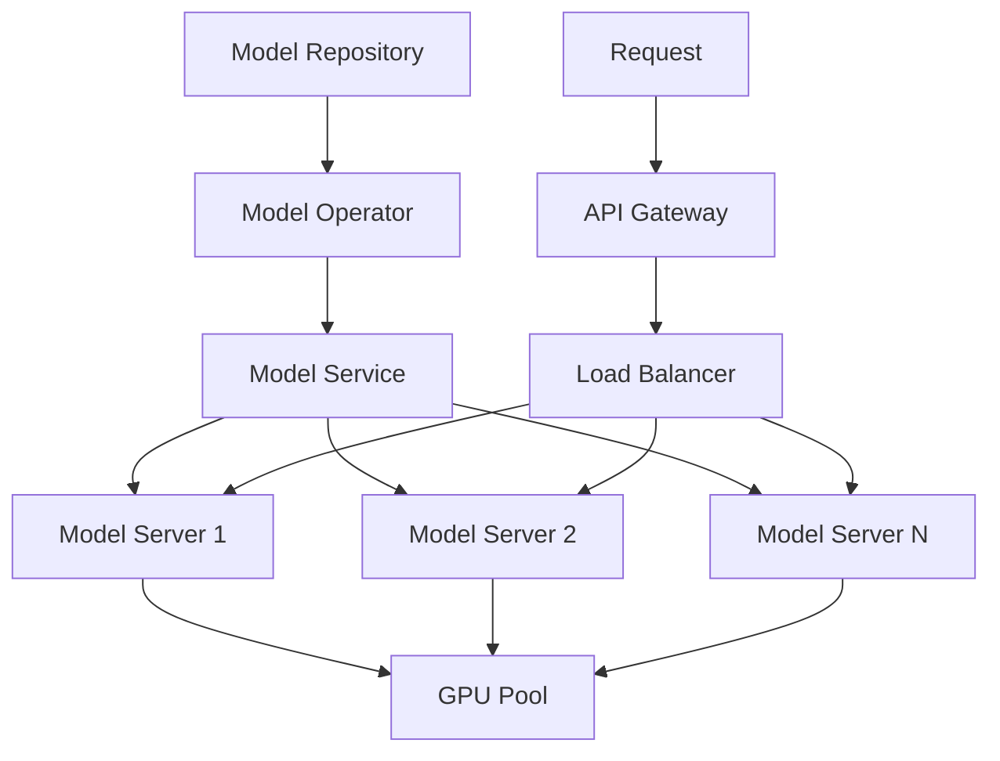

# Building a Scalable AI Inference Platform on Kubernetes

I built an AI inference platform on Kubernetes that enabled easy deployment and management of machine learning models across the organization. This post details the architecture, implementation, and lessons learned from creating a scalable, production-grade ML serving system.

## The Challenge

We needed to:
- Deploy ML models efficiently
- Serve models with low latency
- Scale based on demand
- Monitor model performance
- Manage model versions
- Support multiple frameworks

## Solution Architecture



## Implementation Details

### 1. Custom Kubernetes Operator

We built a custom operator to manage model deployments:

```python
from kopf import on_create, on_delete
import kubernetes as k8s


def create_model(spec, **kwargs):
    # Create model deployment
    deployment = k8s.client.V1Deployment(
        metadata=k8s.client.V1ObjectMeta(
            name=spec['name'],
            namespace=spec['namespace']
        ),
        spec=k8s.client.V1DeploymentSpec(
            replicas=spec.get('replicas', 1),
            template=create_pod_template(spec)
        )
    )
    
    # Create service
    service = k8s.client.V1Service(
        metadata=k8s.client.V1ObjectMeta(
            name=f"{spec['name']}-service"
        ),
        spec=k8s.client.V1ServiceSpec(
            selector={'app': spec['name']},
            ports=[{'port': 8080}]
        )
    )
    
    return {'status': 'created'}
```

### 2. Model Serving Configuration

Example model deployment configuration:

```yaml
kind: MLModel
metadata:
  name: fraud-detection
spec:
  framework: tensorflow
  modelPath: s3://models/fraud-detection/v1
  resources:
    gpu: 1
    memory: "4Gi"
    cpu: "2"
  scaling:
    minReplicas: 2
    maxReplicas: 5
    targetLatency: 100ms
  monitoring:
    enabled: true
    metrics:
      - latency
      - throughput
      - accuracy
```

### 3. Inference API

We implemented a standardized API for model inference:

```python
from fastapi import FastAPI, HTTPException
from pydantic import BaseModel

app = FastAPI()

class PredictionRequest(BaseModel):
    inputs: dict
    model_version: str = "latest"

class PredictionResponse(BaseModel):
    prediction: dict
    latency: float
    model_version: str

@app.post("/predict")
async def predict(request: PredictionRequest):
    try:
        start_time = time.time()
        prediction = model.predict(request.inputs)
        latency = time.time() - start_time
        
        return PredictionResponse(
            prediction=prediction,
            latency=latency,
            model_version=model.version
        )
    except Exception as e:
        raise HTTPException(status_code=500, detail=str(e))
```

### 4. Monitoring and Metrics

We set up comprehensive monitoring:

```python
from prometheus_client import Counter, Histogram

PREDICTION_LATENCY = Histogram(
    'model_prediction_latency_seconds',
    'Time spent processing prediction',
    ['model_name', 'model_version']
)

PREDICTION_REQUESTS = Counter(
    'model_prediction_requests_total',
    'Total prediction requests',
    ['model_name', 'status']
)

def record_metrics(model_name, latency, status):
    PREDICTION_LATENCY.labels(
        model_name=model_name,
        model_version=model.version
    ).observe(latency)
    
    PREDICTION_REQUESTS.labels(
        model_name=model_name,
        status=status
    ).inc()
```

## Key Features

1. **Automated Deployment**
   - GitOps-based model deployment
   - Version control for models
   - Automated rollbacks
   - A/B testing support

2. **Scalability**
   - Horizontal pod autoscaling
   - GPU resource management
   - Load balancing
   - Request batching

3. **Monitoring**
   - Real-time performance metrics
   - Model accuracy tracking
   - Resource utilization
   - Alert management

4. **Framework Support**
   - TensorFlow
   - PyTorch
   - Scikit-learn
   - Custom models

## Performance Optimizations

1. **Request Batching**
   ```python
   class BatchProcessor:
       def __init__(self, batch_size=32, timeout=0.1):
           self.batch_size = batch_size
           self.timeout = timeout
           self.batch = []
           
       async def add_request(self, request):
           self.batch.append(request)
           if len(self.batch) >= self.batch_size:
               return await self.process_batch()
           return None
   ```

2. **GPU Utilization**
   ```python
   class GPUManager:
       def __init__(self):
           self.gpu_memory = {}
           self.model_assignments = {}
           
       def assign_gpu(self, model_name, memory_required):
           available_gpu = self.find_best_gpu(memory_required)
           self.model_assignments[model_name] = available_gpu
   ```

## Results and Impact

The platform delivered significant benefits:
1. 90% reduction in model deployment time
2. 70% improvement in inference latency
3. 80% reduction in operational overhead
4. 100% increase in model serving capacity
5. 60% cost reduction through efficient resource usage

## Challenges Overcome

1. **Resource Management**
   - Challenge: Efficient GPU utilization
   - Solution: Custom scheduler and resource manager

2. **Model Versioning**
   - Challenge: Managing multiple versions
   - Solution: GitOps workflow with version control

3. **Performance Tuning**
   - Challenge: Meeting latency requirements
   - Solution: Request batching and caching

## Best Practices

1. **Model Deployment**
   - Version all models
   - Test before deployment
   - Monitor performance metrics
   - Implement rollback procedures

2. **Resource Management**
   - Set resource limits
   - Monitor utilization
   - Implement autoscaling
   - Optimize batch sizes

3. **Monitoring**
   - Track key metrics
   - Set up alerts
   - Monitor model drift
   - Log predictions

## Future Improvements

1. **Advanced Features**
   - Multi-model serving
   - Dynamic batching
   - Model ensembling
   - Online learning

2. **Infrastructure**
   - Multi-cluster support
   - Edge deployment
   - Cross-region serving
   - Custom hardware support

3. **Monitoring**
   - Automated model retraining
   - Performance prediction
   - Cost optimization
   - Anomaly detection

## Conclusion

Our AI inference platform has transformed how we deploy and manage ML models. By leveraging Kubernetes and building custom tooling, we've created a robust system that enables rapid model deployment while maintaining high performance and reliability.

## Resources

- [KubeFlow Serving](https://www.kubeflow.org/docs/components/serving/)
- [TensorFlow Serving](https://www.tensorflow.org/tfx/serving/architecture)
- [Kubernetes Operators](https://kubernetes.io/docs/concepts/extend-kubernetes/operator/)
