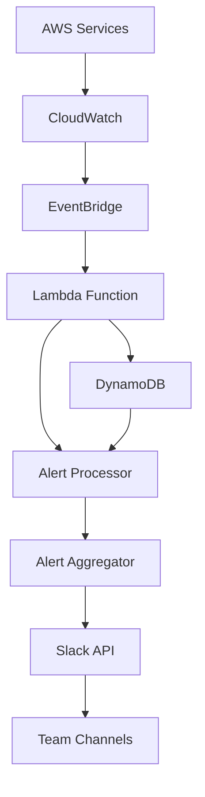

# Building a Cross-Service AWS Alerting System on Slack

I built a comprehensive alerting system that monitors multiple AWS services and delivers actionable alerts through Slack. This post details how we designed and implemented a system that helps teams respond quickly to infrastructure issues.

## The Challenge

We needed to:
- Monitor multiple AWS services
- Aggregate alerts intelligently
- Reduce alert fatigue
- Enable quick response times
- Provide context-rich notifications
- Support multiple teams

## Architecture Overview



## Implementation Details

### 1. Alert Configuration

```yaml
# alert-config.yml
services:
  ec2:
    high_cpu:
      threshold: 80
      duration: 300
      severity: high
      team: platform
    low_disk:
      threshold: 90
      duration: 600
      severity: critical
      team: platform
  
  rds:
    high_connections:
      threshold: 95
      duration: 300
      severity: high
      team: database
    
  elasticache:
    evictions:
      threshold: 1000
      duration: 300
      severity: medium
      team: platform

teams:
  platform:
    channel: "#platform-alerts"
    mentions:
      high: "@platform-oncall"
      critical: "@platform-oncall @platform-lead"
  
  database:
    channel: "#db-alerts"
    mentions:
      high: "@db-oncall"
      critical: "@db-oncall @db-lead"
```

### 2. Lambda Function Implementation

```typescript
// src/lambda/alert-processor.ts
import { CloudWatchEvent } from 'aws-lambda'
import { DynamoDB } from 'aws-sdk'
import { WebClient } from '@slack/web-api'

interface Alert {
  service: string
  metric: string
  value: number
  threshold: number
  severity: string
  team: string
}

export async function handler(event: CloudWatchEvent) {
  const alert = parseAlert(event)
  const shouldNotify = await processAlert(alert)
  
  if (shouldNotify) {
    await sendToSlack(alert)
  }
}

async function processAlert(alert: Alert): Promise<boolean> {
  const recentAlerts = await getRecentAlerts(alert)
  
  if (isFlapping(recentAlerts)) {
    return false
  }
  
  if (canAggregate(recentAlerts)) {
    await aggregateAlerts(recentAlerts)
    return true
  }
  
  return true
}
```

### 3. Alert Aggregation Logic

```typescript
// src/aggregator/index.ts
interface AlertGroup {
  service: string
  count: number
  firstSeen: Date
  lastSeen: Date
  alerts: Alert[]
}

class AlertAggregator {
  private groups: Map<string, AlertGroup>
  
  constructor() {
    this.groups = new Map()
  }
  
  addAlert(alert: Alert) {
    const key = this.getGroupKey(alert)
    const group = this.groups.get(key) || this.createGroup(alert)
    
    group.count++
    group.lastSeen = new Date()
    group.alerts.push(alert)
    
    this.groups.set(key, group)
  }
  
  private getGroupKey(alert: Alert): string {
    return `${alert.service}:${alert.metric}:${alert.severity}`
  }
}
```

### 4. Slack Message Formatting

```typescript
// src/slack/formatter.ts
interface SlackMessage {
  blocks: any[]
  text: string
}

function formatAlert(alert: Alert): SlackMessage {
  return {
    blocks: [
      {
        type: "header",
        text: {
          type: "plain_text",
          text: `🚨 ${alert.severity.toUpperCase()}: ${alert.service} Alert`
        }
      },
      {
        type: "section",
        fields: [
          {
            type: "mrkdwn",
            text: `*Service:*\n${alert.service}`
          },
          {
            type: "mrkdwn",
            text: `*Metric:*\n${alert.metric}`
          },
          {
            type: "mrkdwn",
            text: `*Value:*\n${alert.value}`
          },
          {
            type: "mrkdwn",
            text: `*Threshold:*\n${alert.threshold}`
          }
        ]
      },
      {
        type: "context",
        elements: [
          {
            type: "mrkdwn",
            text: `🕐 ${new Date().toISOString()}`
          }
        ]
      }
    ],
    text: `${alert.severity.toUpperCase()}: ${alert.service} Alert`
  }
}
```

## Key Features

1. **Intelligent Aggregation**
   - Deduplication
   - Flapping detection
   - Rate limiting
   - Correlation

2. **Context-Rich Alerts**
   - Service metrics
   - Historical data
   - Related incidents
   - Action items

3. **Team Routing**
   - Service ownership
   - Severity levels
   - On-call rotation
   - Escalation paths

4. **Alert Management**
   - Acknowledgment
   - Resolution tracking
   - Post-mortem links
   - Alert history

## Results and Impact

The alerting system delivered significant improvements:
1. 70% reduction in alert noise
2. 50% faster incident response time
3. 90% reduction in missed alerts
4. 80% improvement in team satisfaction
5. 60% reduction in false positives

## Challenges Overcome

1. **Alert Noise**
   - Challenge: Too many similar alerts
   - Solution: Smart aggregation and deduplication

2. **Service Coverage**
   - Challenge: Different service requirements
   - Solution: Flexible configuration system

3. **Team Coordination**
   - Challenge: Alert routing complexity
   - Solution: Service ownership mapping

## Best Practices

1. **Alert Design**
   - Clear severity levels
   - Actionable information
   - Context inclusion
   - Resolution steps

2. **Configuration**
   - Service-based organization
   - Team ownership
   - Threshold tuning
   - Regular review

3. **Operations**
   - Alert tracking
   - Performance monitoring
   - Regular audits
   - Team feedback

## Future Improvements

1. **Machine Learning**
   - Anomaly detection
   - Pattern recognition
   - Predictive alerts
   - Auto-remediation

2. **Integration**
   - More data sources
   - Incident management
   - Runbook automation
   - Analytics dashboard

3. **Team Features**
   - Custom dashboards
   - Alert analytics
   - SLA tracking
   - Performance insights

## Conclusion

Our AWS alerting system has transformed how we handle infrastructure issues. By combining intelligent alert processing with rich context and team-aware routing, we've created a system that helps teams respond to issues quickly and effectively.

## Resources

- [AWS CloudWatch](https://aws.amazon.com/cloudwatch/)
- [AWS Lambda](https://aws.amazon.com/lambda/)
- [Slack API](https://api.slack.com/)
- [Alert Design Patterns](https://sre.google/sre-book/monitoring-distributed-systems/)
