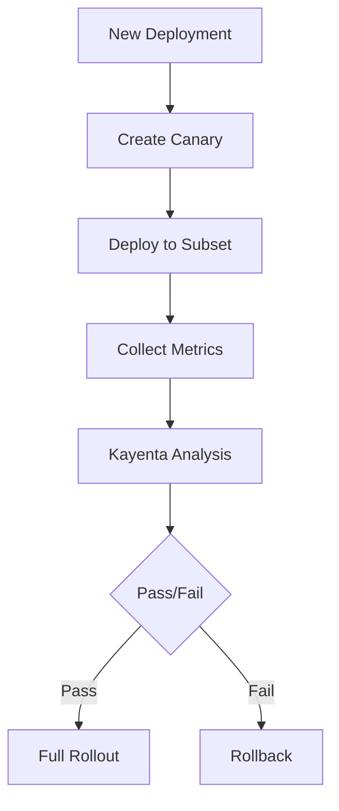

# Automated Canary Analysis with Kayenta

In my role as a Site Reliability Engineer at CRED, I implemented an automated canary analysis system using Kayenta and Referee. This post details the architecture, implementation, and lessons learned from building this system.

## What is Canary Analysis?

Canary analysis is a technique for safely rolling out changes by first testing them on a small subset of users or traffic. The term comes from the historical practice of coal miners using canaries to detect toxic gases - if the canary stopped singing, miners knew there was danger.

In software deployments, canary analysis involves:
1. Deploying a new version to a small subset of infrastructure
2. Comparing metrics between the canary and baseline
3. Making automated decisions about rollout or rollback

## The Challenge

At CRED, we needed to:
- Automate the deployment validation process
- Reduce the risk of problematic deployments
- Make data-driven deployment decisions
- Scale across multiple microservices

## Solution Architecture

We built a system using:
- **Kayenta**: Netflix's automated canary analysis service
- **Referee**: A service that coordinates the canary analysis
- **AWS CloudWatch**: For metrics collection
- **Spinnaker**: For deployment orchestration



## Implementation Details

### 1. Metric Collection

We configured CloudWatch to collect key metrics:
- Error rates
- Latency percentiles
- Resource utilization
- Business metrics

```yaml
metrics:
  - name: error_rate
    query:
      type: cloudwatch
      metricName: Errors
      namespace: Application
      statistic: Sum
  - name: latency_p95
    query:
      type: cloudwatch
      metricName: Latency
      namespace: Application
      statistic: p95
```

### 2. Analysis Configuration

Kayenta was configured with:
- Multiple metric sources
- Custom scoring thresholds
- Automated judgement criteria

```yaml
canary:
  analysis:
    metrics:
      - name: error_rate
        weight: 50
        failureThreshold: 0.02
      - name: latency_p95
        weight: 30
        failureThreshold: 100
    scoreThresholds:
      marginal: 75
      pass: 90
```

### 3. Integration with CI/CD

We integrated the analysis into our deployment pipeline:

```yaml
stages:
  - type: deployCanary
    config:
      clusterPairs:
        - baseline: prod-baseline
          canary: prod-canary
      analysis:
        lookbackMins: 30
        threshold: 90
```

## Results and Impact

The automated canary analysis system:
1. Reduced deployment incidents by 75%
2. Decreased mean time to recovery by 60%
3. Increased deployment confidence
4. Enabled faster iteration cycles

## Lessons Learned

1. **Metric Selection is Critical**
   - Choose metrics that directly indicate user experience
   - Include both technical and business metrics
   - Avoid noisy or unreliable metrics

2. **Tuning Takes Time**
   - Start with conservative thresholds
   - Gradually adjust based on data
   - Consider service-specific requirements

3. **Automation Requirements**
   - Robust metric collection
   - Clear success/failure criteria
   - Reliable rollback mechanisms

4. **Team Adoption**
   - Provide clear documentation
   - Build team confidence gradually
   - Show clear value through metrics

## Future Improvements

We're working on:
1. Machine learning for anomaly detection
2. More sophisticated comparison algorithms
3. Integration with more metric sources
4. Automated threshold adjustment

## Conclusion

Automated canary analysis has become a crucial part of our deployment strategy at CRED. It provides confidence in our deployments while reducing risk and manual intervention. The combination of Kayenta and Referee, along with careful metric selection and threshold tuning, has enabled us to achieve safer, more reliable deployments at scale.

## Resources

- [Kayenta Documentation](https://github.com/spinnaker/kayenta)
- [Spinnaker Automated Canary](https://spinnaker.io/docs/guides/user/canary/)
- [Netflix Engineering Blog on Automated Canary Analysis](https://netflixtechblog.com/automated-canary-analysis-at-netflix-with-kayenta-3260bc7acc69)
