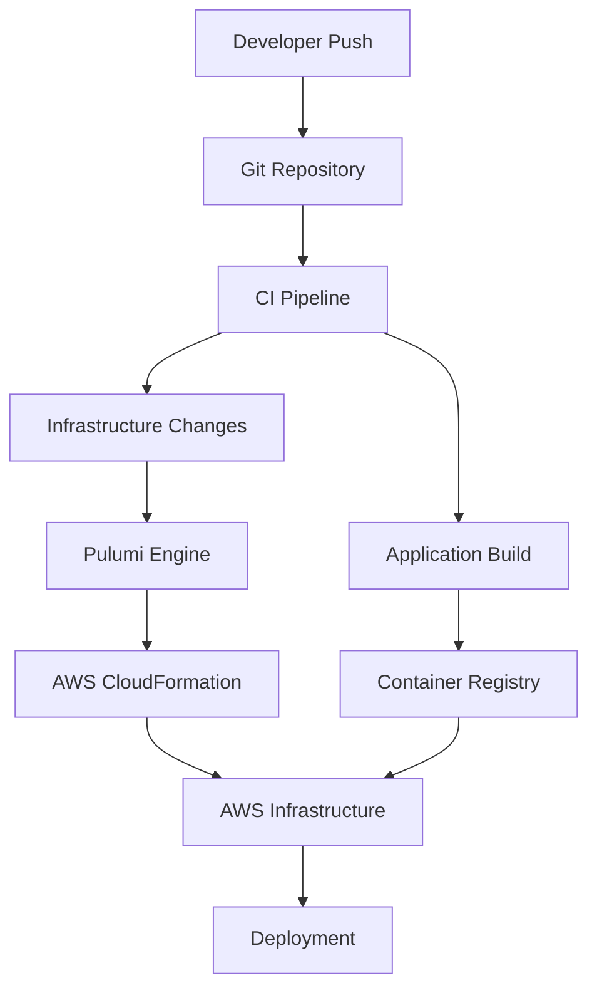

# IaC-Powered CI/CD Framework with Pulumi and CloudFormation

I built a developer-driven CI/CD framework using Infrastructure as Code (IaC) principles, combining the power of Pulumi and CloudFormation. This post details how we created a flexible, scalable deployment system that empowers developers while maintaining infrastructure consistency.

## The Challenge

We faced several challenges with our deployment process:
- Manual infrastructure provisioning
- Inconsistent environments
- Limited developer autonomy
- Complex deployment workflows
- Difficult infrastructure tracking

## Solution Overview

We built a framework that:
1. Uses IaC for all infrastructure
2. Provides developer self-service
3. Ensures consistency across environments
4. Automates security compliance
5. Tracks infrastructure changes

## Architecture



## Implementation Details

### 1. Infrastructure Definition

We use Pulumi with TypeScript for infrastructure definition:

```typescript
import * as pulumi from "@pulumi/pulumi";
import * as aws from "@pulumi/aws";
import * as eks from "@pulumi/eks";

// Define VPC
const vpc = new aws.ec2.Vpc("main", {
    cidrBlock: "10.0.0.0/16",
    enableDnsHostnames: true,
    enableDnsSupport: true,
    tags: {
        Name: "main-vpc",
        Environment: "production"
    }
});

// Create EKS Cluster
const cluster = new eks.Cluster("app-cluster", {
    vpcId: vpc.id,
    subnetIds: vpc.publicSubnets.map(s => s.id),
    instanceType: "t3.medium",
    desiredCapacity: 3,
    minSize: 2,
    maxSize: 5,
    tags: {
        Environment: "production"
    }
});
```

### 2. CI/CD Pipeline Definition

We use a YAML-based pipeline definition:

```yaml
pipeline:
  stages:
    - name: infrastructure
      type: pulumi
      stack: prod
      config:
        cloud: aws
        region: us-east-1
      
    - name: build
      type: docker
      image: app
      context: ./
      
    - name: deploy
      type: kubernetes
      cluster: ${pulumi.cluster.name}
      manifests: ./k8s/
```

### 3. Developer Interface

We created a CLI tool for developers:

```bash
# Create new service infrastructure
infra create service \
  --name payment-service \
  --type microservice \
  --template nodejs

# Deploy changes
infra deploy \
  --service payment-service \
  --env production \
  --version v1.2.3
```

### 4. Security and Compliance

Automated security checks in the pipeline:

```typescript
import { SecurityChecker } from "./security";

const checker = new SecurityChecker({
    rules: [
        "no-public-buckets",
        "encrypted-data",
        "least-privilege-iam"
    ]
});

export const check = async (stack: pulumi.Stack) => {
    const results = await checker.validate(stack);
    if (!results.passed) {
        throw new Error("Security checks failed");
    }
};
```

## Key Features

1. **Infrastructure as Code**
   - Version controlled infrastructure
   - Code review for changes
   - Automated testing
   - Change tracking

2. **Developer Self-Service**
   - Service templates
   - One-command deployments
   - Environment management
   - Infrastructure visibility

3. **Security Integration**
   - Automated compliance checks
   - Secret management
   - Access control
   - Audit logging

4. **Environment Management**
   - Environment parity
   - Configuration management
   - Resource tracking
   - Cost optimization

## Best Practices

1. **Infrastructure Management**
   - Use modular designs
   - Implement strict versioning
   - Document all components
   - Test infrastructure changes

2. **Security**
   - Implement least privilege
   - Encrypt sensitive data
   - Regular security audits
   - Automated compliance checks

3. **Developer Experience**
   - Clear documentation
   - Simple interfaces
   - Fast feedback loops
   - Self-service capabilities

## Results and Impact

The framework delivered significant improvements:
1. 80% reduction in deployment time
2. 90% decrease in configuration errors
3. 70% increase in developer productivity
4. 100% infrastructure compliance
5. 50% reduction in infrastructure costs

## Challenges Overcome

1. **Learning Curve**
   - Challenge: Team adaptation to IaC
   - Solution: Training programs and documentation

2. **State Management**
   - Challenge: Managing infrastructure state
   - Solution: Remote state storage with locking

3. **Migration**
   - Challenge: Moving from manual to IaC
   - Solution: Phased migration with parallel systems

## Future Improvements

1. **Advanced Automation**
   - Cost optimization automation
   - Performance optimization
   - Auto-scaling improvements

2. **Enhanced Developer Tools**
   - Visual infrastructure explorer
   - Cost estimation tools
   - Performance analysis

3. **Machine Learning Integration**
   - Resource optimization
   - Anomaly detection
   - Predictive scaling

## Conclusion

Our IaC-powered CI/CD framework has transformed how we manage infrastructure and deployments. By combining Pulumi and CloudFormation with developer-friendly tools, we've created a system that maintains high standards while enabling developer productivity.

## Resources

- [Pulumi Documentation](https://www.pulumi.com/docs/)
- [AWS CloudFormation](https://aws.amazon.com/cloudformation/)
- [Infrastructure as Code Best Practices](https://www.thoughtworks.com/insights/blog/infrastructure-code-reason-smile)
