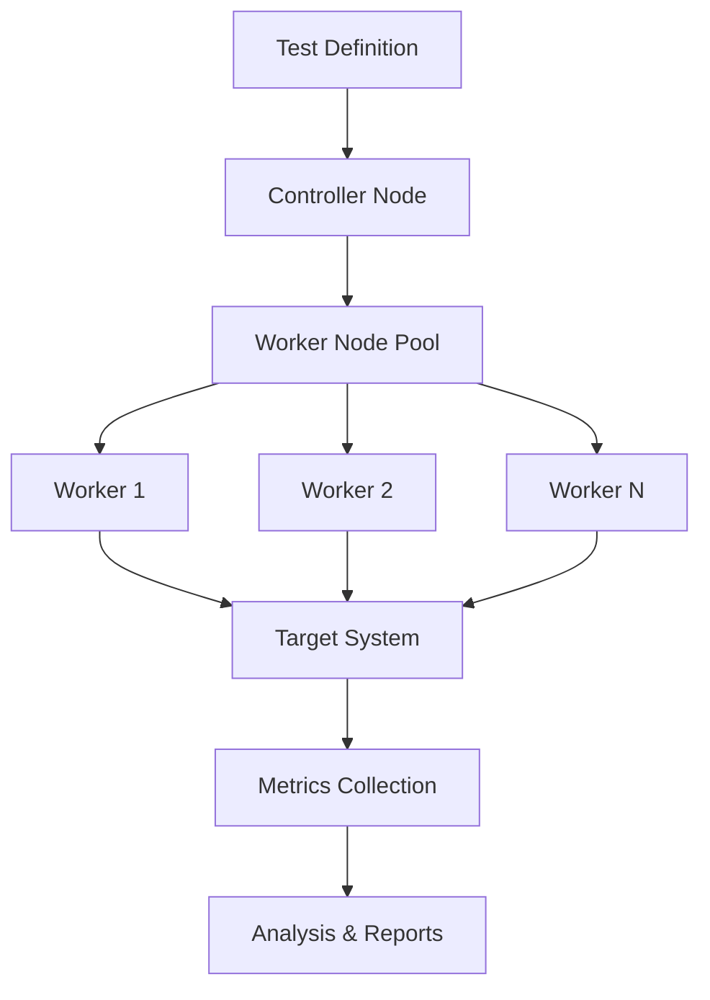

# Scalable Performance Testing with Locust

I built a scalable performance testing framework using distributed Locust nodes. This post details how we designed and implemented a system that could simulate realistic user loads and provide actionable performance insights.

## The Need for Performance Testing

In a fintech application, performance is critical. We needed to:
- Simulate real-world user behavior at scale
- Test system performance under various load conditions
- Identify bottlenecks before they impact users
- Validate performance improvements
- Ensure system stability during high-traffic events

## Why Locust?

We chose Locust for several reasons:
1. **Python-based**: Easy to write and maintain test scenarios
2. **Distributed Architecture**: Supports running tests across multiple nodes
3. **Real-time Metrics**: Provides live insights during test execution
4. **Extensible**: Can be customized for specific needs
5. **Developer-friendly**: Tests written as code, not through UI

## Architecture Overview



## Implementation Details

### 1. Test Scenario Definition

We defined test scenarios in Python using Locust's user behavior classes:

```python
from locust import HttpUser, task, between

class User(HttpUser):
    wait_time = between(1, 5)
    
    def on_start(self):
        self.login()
    
    @task(3)
    def view_dashboard(self):
        self.client.get("/dashboard")
        
    @task(2)
    def make_payment(self):
        self.client.post("/payment", json={
            "amount": 1000,
            "card_id": "test_card"
        })
```

### 2. Infrastructure Setup

We created an on-demand infrastructure using AWS:

```yaml
infrastructure:
  controller:
    instance_type: c5.xlarge
    cpu: 4
    memory: 8GB
  workers:
    instance_type: c5.2xlarge
    cpu: 8
    memory: 16GB
    min_count: 2
    max_count: 10
    scaling:
      metric: rps
      target: 1000
```

### 3. Test Orchestration

The framework provides a simple CLI for test execution:

```bash
# Run a test with specific parameters
performance-test run \
  --scenario payment_flow \
  --users 10000 \
  --spawn-rate 100 \
  --duration 30m \
  --workers auto

# Monitor test progress
performance-test monitor \
  --test-id test_123 \
  --metrics rps,response_time,error_rate
```

### 4. Metrics Collection

We collect various metrics during test execution:

```python
@events.test_start.add_listener
def on_test_start(**kwargs):
    setup_metrics_collection()

@events.request.add_listener
def on_request(request_type, name, response_time, response_length, **kwargs):
    record_metric("response_time", response_time)
    record_metric("throughput", response_length)
```

## Key Features

1. **Dynamic Scaling**
   - Automatically scales worker nodes based on load
   - Optimizes resource usage during tests
   - Supports burst testing scenarios

2. **Real-time Monitoring**
   - Live metrics dashboard
   - Real-time alerts on threshold violations
   - Test progress tracking

3. **Test Scenarios Library**
   - Reusable test components
   - Common user flows
   - Parameterized scenarios

4. **Reporting**
   - Detailed performance reports
   - Trend analysis
   - Bottleneck identification
   - Recommendations for improvement

## Results and Impact

The framework has enabled us to:
1. Identify performance bottlenecks early
2. Validate system improvements
3. Ensure stability during peak events
4. Reduce performance testing costs by 60%
5. Increase test coverage by 3x

## Best Practices

1. **Test Design**
   - Model real user behavior
   - Include think time between actions
   - Use realistic data
   - Test edge cases

2. **Resource Management**
   - Start with small tests
   - Monitor resource usage
   - Scale gradually
   - Clean up after tests

3. **Data Analysis**
   - Focus on business-relevant metrics
   - Consider percentiles, not just averages
   - Correlate metrics with system changes
   - Track trends over time

## Challenges and Solutions

1. **Test Data Management**
   - Challenge: Maintaining test data at scale
   - Solution: Automated data generation and cleanup

2. **Resource Optimization**
   - Challenge: Cost of running large tests
   - Solution: Dynamic scaling and scheduling

3. **Result Reliability**
   - Challenge: Inconsistent results
   - Solution: Standardized environments and baselines

## Future Improvements

1. **Machine Learning Integration**
   - Anomaly detection
   - Automatic threshold adjustment
   - Performance prediction

2. **Enhanced Automation**
   - CI/CD integration
   - Automatic test generation
   - Self-healing tests

3. **Advanced Analytics**
   - Pattern recognition
   - Root cause analysis
   - Predictive insights

## Conclusion

Our scalable performance testing framework has become an essential tool for ensuring system reliability and performance. By leveraging Locust's capabilities and adding our own orchestration layer, we've created a powerful system that helps us maintain high performance standards while keeping testing costs under control.

## Resources

- [Locust Documentation](https://docs.locust.io/)
- [AWS Auto Scaling](https://aws.amazon.com/autoscaling/)
- [Performance Testing Best Practices](https://www.blazemeter.com/blog/performance-testing-best-practices)
