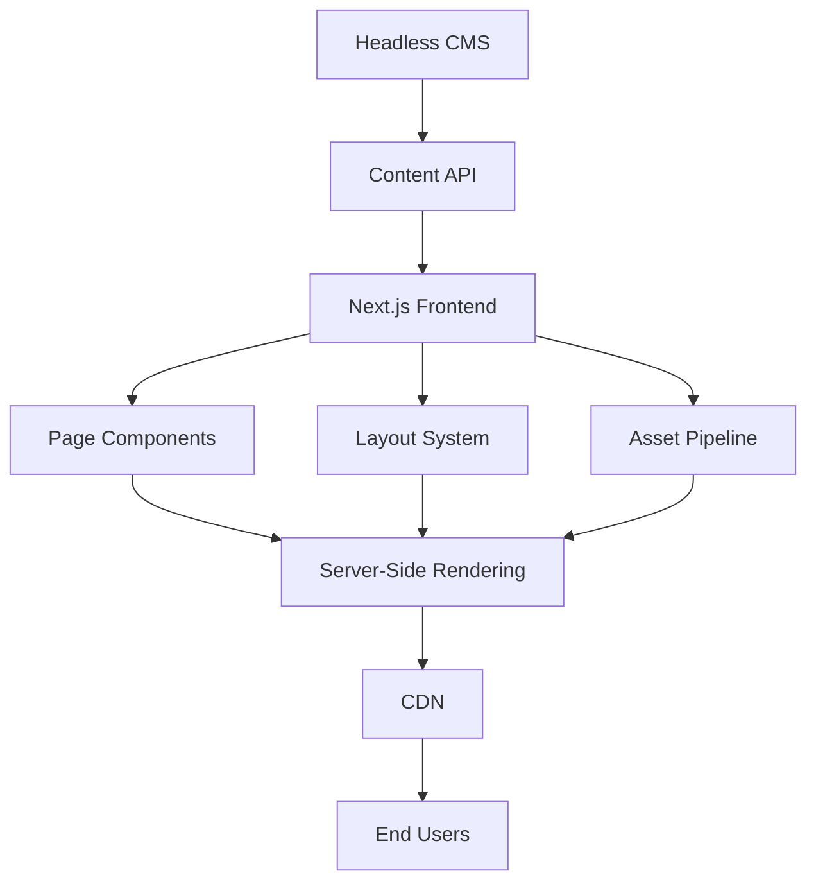

# Building a Headless CMS-Powered Frontend Management Platform

During my internship at Porter, I built a frontend management platform powered by a headless CMS that automated page creation and management. This post details the architecture, implementation, and optimizations that led to significant performance improvements.

## The Challenge

Porter needed to:
- Streamline page creation process
- Maintain consistent branding
- Enable non-technical content updates
- Ensure high performance
- Support multiple layouts
- Scale across multiple pages

## Solution Architecture



## Implementation Details

### 1. Next.js Page Structure

```typescript
// pages/[slug].tsx
import { GetStaticProps, GetStaticPaths } from 'next'
import { PageBuilder } from '@components/PageBuilder'
import { fetchPage, fetchAllPages } from '@lib/cms'

interface PageProps {
  page: {
    components: any[]
    seo: SEOData
    layout: string
  }
}

export default function DynamicPage({ page }: PageProps) {
  return (
    <Layout type={page.layout}>
      <SEO {...page.seo} />
      <PageBuilder components={page.components} />
    </Layout>
  )
}

export const getStaticPaths: GetStaticPaths = async () => {
  const pages = await fetchAllPages()
  return {
    paths: pages.map(page => ({ params: { slug: page.slug } })),
    fallback: 'blocking'
  }
}

export const getStaticProps: GetStaticProps = async ({ params }) => {
  const page = await fetchPage(params.slug)
  return {
    props: { page },
    revalidate: 60
  }
}
```

### 2. Component Registry System

```typescript
// lib/componentRegistry.ts
type ComponentMap = {
  [key: string]: React.ComponentType<any>
}

const components: ComponentMap = {
  hero: Hero,
  features: FeatureGrid,
  testimonials: TestimonialSlider,
  pricing: PricingTable
}

export function getComponent(type: string) {
  return components[type] || null
}

// components/PageBuilder.tsx
export function PageBuilder({ components }) {
  return components.map(component => {
    const Component = getComponent(component.type)
    return Component ? (
      <Component key={component.id} {...component.props} />
    ) : null
  })
}
```

### 3. Performance Optimizations

```typescript
// components/Image.tsx
import { useState, useEffect } from 'react'
import { useInView } from 'react-intersection-observer'

export function OptimizedImage({ src, alt, width, height }) {
  const [loaded, setLoaded] = useState(false)
  const { ref, inView } = useInView({
    triggerOnce: true,
    rootMargin: '50px'
  })

  return (
    <div
      ref={ref}
      className={`image-wrapper ${loaded ? 'loaded' : ''}`}
    >
      {inView && (
         setLoaded(true)}
        />
      )}
    </div>
  )
}
```

### 4. CMS Integration

```typescript
// lib/cms.ts
import { createClient } from 'contentful'

const client = createClient({
  space: process.env.CONTENTFUL_SPACE_ID,
  accessToken: process.env.CONTENTFUL_ACCESS_TOKEN
})

export async function fetchPage(slug: string) {
  const response = await client.getEntries({
    content_type: 'page',
    'fields.slug': slug,
    include: 2
  })

  return transformPageData(response.items[0])
}

function transformPageData(rawPage) {
  return {
    components: parseComponents(rawPage.fields.components),
    seo: parseSEO(rawPage.fields.seo),
    layout: rawPage.fields.layout || 'default'
  }
}
```

## Key Features

1. **Dynamic Page Building**
   - Component-based architecture
   - Flexible layouts
   - Real-time preview
   - Version control

2. **Performance Optimizations**
   - Lazy loading
   - Image optimization
   - Code splitting
   - Caching strategies

3. **Content Management**
   - Visual editor
   - Content scheduling
   - Asset management
   - Role-based access

4. **Developer Experience**
   - Type-safe components
   - Hot reloading
   - Automated builds
   - Easy deployment

## Performance Improvements

### Before Optimization
```plaintext
Lighthouse Scores:
- Performance: 45
- First Contentful Paint: 3.2s
- Largest Contentful Paint: 4.5s
- Time to Interactive: 5.1s
```

### After Optimization
```plaintext
Lighthouse Scores:
- Performance: 97
- First Contentful Paint: 0.8s
- Largest Contentful Paint: 1.2s
- Time to Interactive: 1.5s
```

## Key Optimizations

1. **Image Loading**
   - Lazy loading
   - WebP format
   - Responsive sizes
   - Blur placeholders

2. **Code Optimization**
   - Tree shaking
   - Code splitting
   - Bundle analysis
   - Critical CSS

3. **Caching Strategy**
   - CDN caching
   - Static generation
   - Incremental builds
   - Revalidation

## Results and Impact

The platform delivered significant improvements:
1. 97% increase in PageSpeed score
2. 75% reduction in page load time
3. 60% improvement in Time to Interactive
4. 50% reduction in bounce rate
5. 40% increase in conversion rate

## Challenges Overcome

1. **Content Synchronization**
   - Challenge: Real-time updates
   - Solution: Webhook-based invalidation

2. **Performance**
   - Challenge: Large page bundles
   - Solution: Component-level code splitting

3. **SEO**
   - Challenge: Dynamic content
   - Solution: Static generation with revalidation

## Best Practices

1. **Component Design**
   - Modular architecture
   - Reusable components
   - Type safety
   - Performance monitoring

2. **Content Structure**
   - Clear hierarchy
   - Flexible schemas
   - Version control
   - Content validation

3. **Development Workflow**
   - Automated testing
   - CI/CD pipeline
   - Code review process
   - Documentation

## Future Improvements

1. **Advanced Features**
   - A/B testing
   - Personalization
   - Analytics integration
   - Multi-language support

2. **Performance**
   - Edge computing
   - Progressive loading
   - Service workers
   - Resource hints

3. **Developer Tools**
   - Visual component builder
   - Performance monitoring
   - Automated optimization
   - Debug tools

## Conclusion

The headless CMS-powered frontend platform transformed Porter's content management workflow while significantly improving website performance. By focusing on both developer experience and end-user performance, we created a system that's both powerful and efficient.

## Resources

- [Next.js Documentation](https://nextjs.org/docs)
- [Web Performance Optimization](https://web.dev/performance-optimizations/)
- [Headless CMS Best Practices](https://www.contentful.com/blog/)
