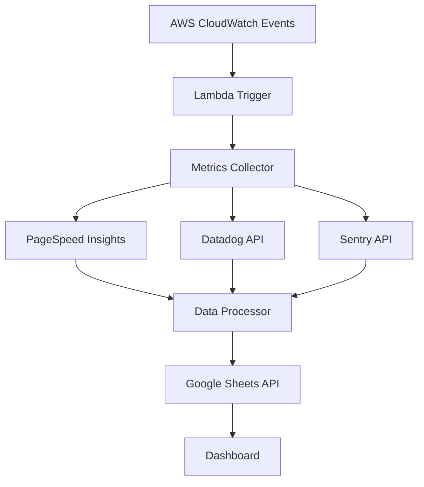

# Automating Performance and Health Metrics Collection

During my internship at Porter, I built an automated system for collecting and analyzing performance and health metrics across applications. This post details how we automated the collection of metrics from PageSpeed Insights, Datadog, and Sentry to provide comprehensive insights into our applications' performance and health.

## The Challenge

We needed to:
- Automate metrics collection from multiple sources
- Aggregate data in a central location
- Provide easy access to historical data
- Enable trend analysis
- Alert on performance regressions
- Make data easily accessible to teams

## Architecture Overview



## Implementation Details

### 1. Lambda Function Setup

```typescript
// src/lambda/metrics-collector.ts
import { PageSpeedInsights } from './collectors/psi'
import { DatadogMetrics } from './collectors/datadog'
import { SentryMetrics } from './collectors/sentry'
import { GoogleSheetsExporter } from './exporters/sheets'

export async function handler(event: any) {
  const collectors = [
    new PageSpeedInsights(),
    new DatadogMetrics(),
    new SentryMetrics()
  ]
  
  const exporter = new GoogleSheetsExporter({
    spreadsheetId: process.env.SHEET_ID,
    credentials: JSON.parse(process.env.GOOGLE_CREDS)
  })
  
  for (const collector of collectors) {
    const metrics = await collector.collect()
    await exporter.export(metrics)
  }
}
```

### 2. PageSpeed Insights Collection

```typescript
// src/collectors/psi.ts
import { PageSpeedAPI } from '@google/pagespeed'

export class PageSpeedInsights {
  private api: PageSpeedAPI
  private urls: string[]
  
  constructor() {
    this.api = new PageSpeedAPI({
      key: process.env.PSI_API_KEY
    })
    this.urls = JSON.parse(process.env.MONITORED_URLS)
  }
  
  async collect() {
    const metrics = []
    
    for (const url of this.urls) {
      const data = await this.api.runPagespeed(url, {
        strategy: 'mobile'
      })
      
      metrics.push({
        url,
        timestamp: new Date(),
        fcp: data.loadingExperience.metrics.FIRST_CONTENTFUL_PAINT_MS.median,
        lcp: data.loadingExperience.metrics.LARGEST_CONTENTFUL_PAINT_MS.median,
        cls: data.loadingExperience.metrics.CUMULATIVE_LAYOUT_SHIFT_SCORE.median,
        performance: data.lighthouseResult.categories.performance.score * 100
      })
    }
    
    return metrics
  }
}
```

### 3. Datadog Metrics Collection

```typescript
// src/collectors/datadog.ts
import { client, v1 } from '@datadog/datadog-api-client'

export class DatadogMetrics {
  private api: v1.MetricsApi
  
  constructor() {
    const configuration = client.createConfiguration({
      authMethods: {
        apiKeyAuth: process.env.DD_API_KEY,
        appKeyAuth: process.env.DD_APP_KEY
      }
    })
    this.api = new v1.MetricsApi(configuration)
  }
  
  async collect() {
    const end = Math.floor(Date.now() / 1000)
    const start = end - 3600 // Last hour
    
    const metrics = await this.api.queryMetrics({
      from: start,
      to: end,
      query: [
        'avg:system.cpu.user{*}',
        'avg:system.memory.used{*}',
        'avg:http.response_time{*}'
      ]
    })
    
    return this.processMetrics(metrics)
  }
}
```

### 4. Sentry Error Tracking

```typescript
// src/collectors/sentry.ts
import { Client } from '@sentry/node'

export class SentryMetrics {
  private client: Client
  
  constructor() {
    this.client = new Client({
      dsn: process.env.SENTRY_DSN,
      token: process.env.SENTRY_TOKEN
    })
  }
  
  async collect() {
    const now = new Date()
    const hourAgo = new Date(now.getTime() - 3600000)
    
    const issues = await this.client.api.issues.list({
      statsPeriod: '1h',
      query: 'is:unresolved'
    })
    
    return {
      timestamp: now,
      newIssues: issues.filter(i => i.firstSeen > hourAgo).length,
      totalIssues: issues.length,
      criticalIssues: issues.filter(i => i.level === 'fatal').length
    }
  }
}
```

### 5. Google Sheets Export

```typescript
// src/exporters/sheets.ts
import { google } from 'googleapis'

export class GoogleSheetsExporter {
  private sheets: google.sheets_v4.Sheets
  private spreadsheetId: string
  
  constructor(config: ExporterConfig) {
    const auth = new google.auth.GoogleAuth({
      credentials: config.credentials,
      scopes: ['https://www.googleapis.com/auth/spreadsheets']
    })
    
    this.sheets = google.sheets({ version: 'v4', auth })
    this.spreadsheetId = config.spreadsheetId
  }
  
  async export(data: any[]) {
    const values = data.map(this.formatRow)
    
    await this.sheets.spreadsheets.values.append({
      spreadsheetId: this.spreadsheetId,
      range: 'Metrics!A:Z',
      valueInputOption: 'RAW',
      requestBody: {
        values
      }
    })
  }
}
```

## Key Features

1. **Automated Collection**
   - Scheduled metric collection
   - Multiple data sources
   - Error handling
   - Retry mechanisms

2. **Data Processing**
   - Metric normalization
   - Data validation
   - Trend calculation
   - Anomaly detection

3. **Data Export**
   - Google Sheets integration
   - Historical data storage
   - Automated formatting
   - Access control

4. **Monitoring**
   - Real-time alerts
   - Performance tracking
   - Error monitoring
   - Resource utilization

## Results and Impact

The automation system delivered significant benefits:
1. 95% reduction in manual data collection time
2. Real-time visibility into performance metrics
3. Early detection of performance regressions
4. Improved cross-team collaboration
5. Data-driven decision making

## Challenges Overcome

1. **API Rate Limits**
   - Challenge: API usage restrictions
   - Solution: Request batching and caching

2. **Data Consistency**
   - Challenge: Different metric formats
   - Solution: Standardized data processing

3. **Historical Data**
   - Challenge: Managing large datasets
   - Solution: Efficient storage and archival

## Best Practices

1. **Data Collection**
   - Regular intervals
   - Error handling
   - Data validation
   - Rate limiting

2. **Processing**
   - Standard formats
   - Data cleaning
   - Efficient algorithms
   - Quality checks

3. **Storage**
   - Data retention
   - Backup strategy
   - Access control
   - Version tracking

## Future Improvements

1. **Advanced Analytics**
   - Machine learning integration
   - Predictive analytics
   - Automated insights
   - Custom metrics

2. **Visualization**
   - Interactive dashboards
   - Custom reports
   - Real-time updates
   - Trend analysis

3. **Integration**
   - Additional data sources
   - CI/CD integration
   - Custom alerting
   - API access

## Conclusion

The automated metrics collection system has transformed how we monitor and improve application performance at Porter. By centralizing data collection and analysis, we've enabled teams to make data-driven decisions and respond quickly to performance issues.

## Resources

- [PageSpeed Insights API](https://developers.google.com/speed/docs/insights/v5/get-started)
- [Datadog API](https://docs.datadoghq.com/api/)
- [Sentry API](https://docs.sentry.io/api/)
- [Google Sheets API](https://developers.google.com/sheets/api)
