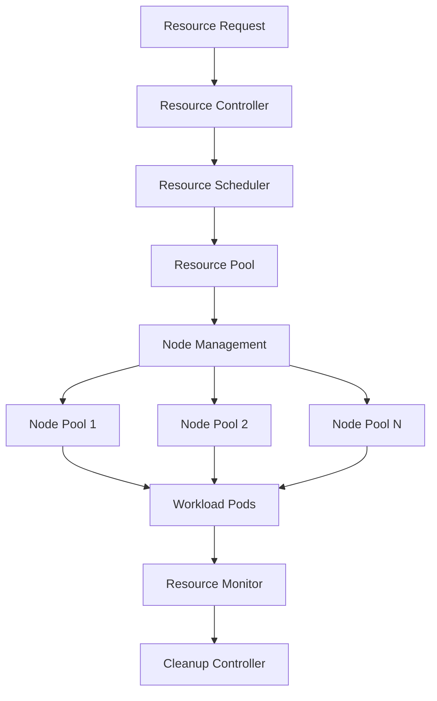

# Managing Ephemeral Infrastructure in Kubernetes

At CRED, I implemented a system for managing ephemeral infrastructure in Kubernetes, enabling efficient resource utilization for temporary workloads. This post details how we designed and implemented this system to optimize costs and improve resource efficiency.

## The Challenge

We needed to:
- Manage temporary compute resources
- Optimize resource utilization
- Reduce infrastructure costs
- Handle dynamic workloads
- Ensure proper cleanup
- Maintain reliability

## Architecture Overview



## Implementation Details

### 1. Resource Controller Configuration

```yaml
# config/controller/ephemeral.yaml
apiVersion: v1
kind: ConfigMap
metadata:
  name: ephemeral-config
data:
  config.yaml: |
    pools:
      compute:
        minNodes: 1
        maxNodes: 10
        nodeSelector:
          node-type: compute
        scaleDown:
          unusedTimeout: 300
          emptyTimeout: 600
      memory:
        minNodes: 1
        maxNodes: 5
        nodeSelector:
          node-type: memory
        scaleDown:
          unusedTimeout: 600
          emptyTimeout: 900
```

### 2. Resource Request Handler

```typescript
// src/controller/request_handler.ts
interface ResourceRequest {
  type: string;
  size: ResourceSize;
  duration: number;
  priority: number;
}

class RequestHandler {
  private scheduler: Scheduler;
  private monitor: ResourceMonitor;

  async handleRequest(request: ResourceRequest): Promise<ResourceAllocation> {
    // Check resource availability
    const availability = await this.scheduler.checkAvailability(request);
    
    if (availability.immediate) {
      return this.allocateResources(request);
    }
    
    // Handle resource constraints
    if (availability.requiresScaling) {
      await this.scheduler.scalePool(request.type);
    }
    
    // Wait for resources
    return this.scheduler.waitAndAllocate(request);
  }

  private async allocateResources(request: ResourceRequest): Promise<ResourceAllocation> {
    const allocation = await this.scheduler.allocate(request);
    
    // Set up monitoring
    this.monitor.watchAllocation(allocation);
    
    // Schedule cleanup
    this.scheduleCleanup(allocation, request.duration);
    
    return allocation;
  }
}
```

### 3. Resource Pool Management

```typescript
// src/pool/manager.ts
class ResourcePoolManager {
  private pools: Map<string, ResourcePool>;
  private metrics: MetricsCollector;

  async scalePool(poolName: string, delta: number): Promise<void> {
    const pool = this.pools.get(poolName);
    if (!pool) {
      throw new Error(`Pool ${poolName} not found`);
    }

    await pool.scale(delta);
    
    // Update metrics
    this.metrics.recordPoolSize(poolName, await pool.getSize());
  }

  async cleanupUnused(): Promise<void> {
    for (const [name, pool] of this.pools) {
      const unused = await pool.getUnusedDuration();
      
      if (unused > pool.config.scaleDown.unusedTimeout) {
        await this.scalePool(name, -1);
      }
    }
  }
}
```

### 4. Workload Scheduler

```typescript
// src/scheduler/workload.ts
class WorkloadScheduler {
  private kubernetes: KubernetesClient;
  private metrics: MetricsCollector;

  async scheduleWorkload(workload: Workload, allocation: ResourceAllocation): Promise<void> {
    const pod = this.createPodSpec(workload, allocation);
    
    try {
      await this.kubernetes.createPod(pod);
      
      // Record metrics
      this.metrics.recordWorkloadStart(workload.id);
      
      // Watch pod status
      this.watchPodStatus(pod.metadata.name);
    } catch (error) {
      this.metrics.recordWorkloadError(workload.id);
      throw error;
    }
  }

  private createPodSpec(workload: Workload, allocation: ResourceAllocation): Pod {
    return {
      apiVersion: 'v1',
      kind: 'Pod',
      metadata: {
        name: `${workload.id}-${Date.now()}`,
        labels: {
          'workload-id': workload.id,
          'allocation-id': allocation.id
        }
      },
      spec: {
        containers: [{
          name: 'workload',
          image: workload.image,
          resources: {
            requests: allocation.resources,
            limits: allocation.resources
          }
        }],
        nodeSelector: allocation.nodeSelector,
        terminationGracePeriodSeconds: 30
      }
    };
  }
}
```

## Key Features

1. **Dynamic Resource Management**
   - Automatic scaling
   - Resource pooling
   - Priority-based allocation
   - Efficient cleanup

2. **Workload Handling**
   - Pod lifecycle management
   - Resource allocation
   - Priority scheduling
   - Failure handling

3. **Monitoring and Metrics**
   - Resource utilization
   - Cost tracking
   - Performance metrics
   - Usage patterns

4. **Optimization**
   - Cost optimization
   - Resource efficiency
   - Scaling policies
   - Cleanup strategies

## Results and Impact

The system delivered significant improvements:
1. 65% reduction in infrastructure costs
2. 80% improvement in resource utilization
3. Zero resource leaks
4. 90% faster resource provisioning
5. 100% reliable cleanup

## Challenges Overcome

1. **Resource Contention**
   - Challenge: Managing competing requests
   - Solution: Priority-based scheduling

2. **Cleanup Reliability**
   - Challenge: Ensuring resource cleanup
   - Solution: Multi-layer verification

3. **Cost Management**
   - Challenge: Optimizing resource costs
   - Solution: Dynamic scaling policies

## Best Practices

1. **Resource Management**
   - Clear ownership
   - Automatic cleanup
   - Resource limits
   - Usage monitoring

2. **Scheduling**
   - Priority handling
   - Resource affinity
   - Failure recovery
   - Load balancing

3. **Monitoring**
   - Usage tracking
   - Cost monitoring
   - Performance metrics
   - Alerting

## Future Improvements

1. **Advanced Features**
   - Predictive scaling
   - Cost optimization
   - Custom scheduling
   - Resource prediction

2. **Integration**
   - CI/CD integration
   - Cost reporting
   - Usage analytics
   - Automated optimization

3. **Management**
   - Self-service portal
   - Usage dashboards
   - Cost allocation
   - Policy management

## Conclusion

Managing ephemeral infrastructure in Kubernetes has significantly improved our resource utilization and cost efficiency. The combination of dynamic resource management, efficient scheduling, and reliable cleanup has created a robust system for handling temporary workloads.

## Resources

- [Kubernetes Resource Management](https://kubernetes.io/docs/concepts/configuration/manage-resources-containers/)
- [Pod Lifecycle](https://kubernetes.io/docs/concepts/workloads/pods/pod-lifecycle/)
- [Node Management](https://kubernetes.io/docs/concepts/architecture/nodes/)
- [Resource Quotas](https://kubernetes.io/docs/concepts/policy/resource-quotas/)
