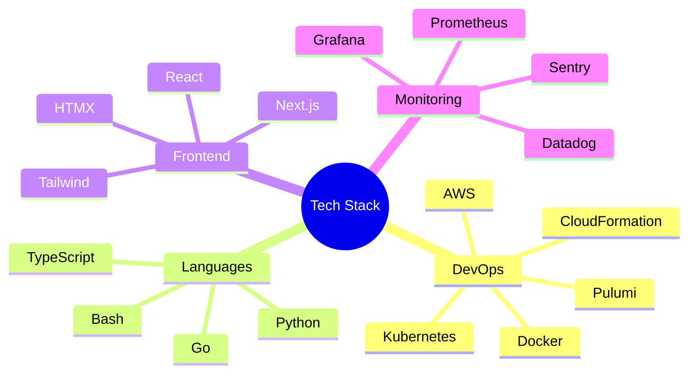

# 👋 Hey there, I'm Parth!

I'm a Site Reliability Engineer with a passion for building scalable systems, optimizing performance, and automating everything in sight. Currently crafting reliable infrastructure and developer experiences.

## 🚀 What I Do

When I'm not battling production fires (which, thanks to good SRE practices, is most of the time!), I'm:
- Building automated canary systems that make deployments less scary
- Creating performance testing frameworks that handle millions of requests
- Optimizing web applications to load faster than you can say "performance"
- Teaching Kubernetes new tricks with custom operators
- Making AI models serve predictions at the speed of thought

## 💡 Blog Sections

### [[DevOps/DevOps|DevOps and SRE]]
Journey into the world of Site Reliability Engineering! From automated canary analysis to scalable performance testing, discover how we keep systems running smoothly at scale.

### [[Frontend/Frontend|Frontend Development]]
Dive into modern web development! Learn about building CMS-powered platforms, optimizing web performance to achieve 97+ Lighthouse scores, and automating metrics collection.

### [[AI/AI|AI and Machine Learning]]
Explore the intersection of AI and infrastructure! See how we built a scalable inference platform that serves ML models across an entire organization.

### [[GIS/GIS|Geographic Information Systems]]
Venture into the world of spatial data! Discover how to analyze and visualize geographic information using modern GIS tools.

## 🛠 Tech Stack

I work with a variety of technologies:

## 🎯 What's Next?

I'm constantly exploring new technologies and sharing my learnings. Currently, I'm diving deeper into:
- Edge computing and distributed systems
- Machine learning infrastructure
- Performance optimization at scale
- Infrastructure as Code best practices

Feel free to explore my blog posts to learn more about these topics and join me on this technical journey!

## 📫 Get in Touch

- 📧 Email: bisenparth03@gmail.com
- 🐙 GitHub: [github.com/pbisen](https://github.com/pbisen)
- 🔗 LinkedIn: [linkedin.com/in/pbisen](https://linkedin.com/in/pbisen)

Let's connect and build something awesome together! 🚀
